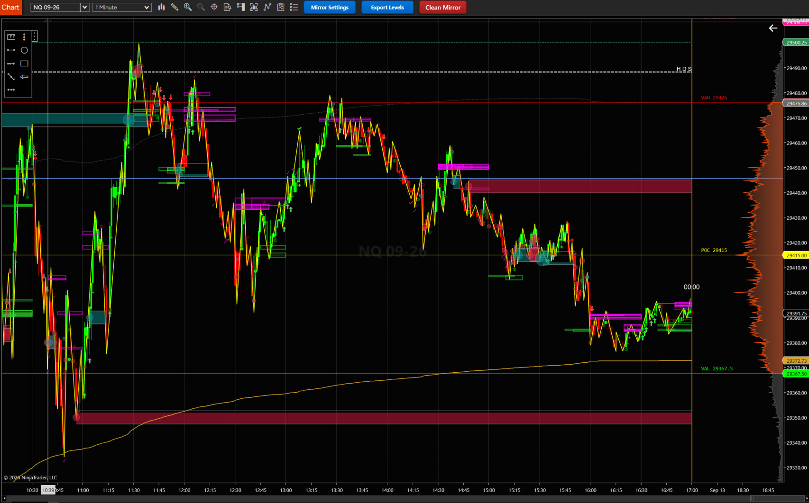

# Alighten NinjaTrader 8 Indicator Suite

A proprietary suite of custom NinjaTrader 8 indicators for order flow analysis, multi-timeframe
pattern recognition, and chart visualization — centered on the **Alighten Mirror Dashboard**
ecosystem.

This README is organized around the **reference chart**: the saved chart template in
`NinjaTrader/Templates/Chart/`, which is the intended way to load the suite. Everything the chart
needs is listed under [The reference chart](#the-reference-chart); everything else in the repo is
catalogued under [Other indicators](#other-indicators-not-on-the-reference-chart).

---

## The reference chart

**Template:** `NinjaTrader/Templates/Chart/Alighten_20260911.xml`
**Built on:** NQ 09-26, 1 Minute, 5 days back (the template stores the period and days-back; the
instrument comes from whatever chart you apply it to).



The chart is a single price panel carrying eleven indicators. Reading it:

* A **session volume profile** on the right edge, with **VAH** (red), **POC** (yellow) and **VAL**
  (green) extended left across the session as horizontal rails.
* The **session VWAP** as a goldenrod curve, with three pairs of gray dashed standard-deviation
  bands at 1σ / 2σ / 3σ.
* **Prior-day high and low** in deep pink.
* **Mirror levels and zones** as horizontal bands. Only the *inside* zone set is drawing on this
  chart — long zones green (`#25D725`), short zones magenta (`#FF00FF`), filled at 5% opacity with a
  50%-opacity outline, which is why they read as dark tints against the black background. Narrow
  bright bands are individual pattern levels. A yellow zigzag traces the structure the pattern
  engines are keyed to.
* Small arrows, dots and check marks on the bars are **confirmed pattern signals**.
* Three toolbar buttons — **Mirror Settings**, **Export Levels**, **Clean Mirror** — drive the
  Mirror's live settings modal, its CSV export, and its zone teardown/redraw.

### How this chart is configured

Two of these will surprise anyone reading the screenshot and assuming the Mirror is running wide
open. Values below are read directly out of the template.

| Setting | Value |
|---|---|
| Signal Groups (primary zones) | **disabled** — `EnableSignalGroups = false` |
| Inside Zones | **enabled** — `MirrorInsideZonesV0040.txt` |
| Pattern engines computing | all six — A, B, G, H, F, J |
| Levels actually drawn | **Daily only**, and only for A, G, H and F |
| Pattern B and Pattern J levels | computed, not drawn |
| Daily Bias Levels | enabled — goldenrod above, deep sky blue below |
| Cross arrows | shown |
| Research log | enabled |
| Drawing caps | 500 per zone set |
| Zone merging | off for both sets |
| Mirror source bars to process | 500 (`SrcBarsToProcess`) |

So **every zone band on the chart is an inside zone** — the primary confluence set is switched off
entirely. And although all six engines run and keep feeding the zone search, level *drawing* is
restricted to the Daily timeframe for four of the six patterns; Pattern J, the densest source, is
computing invisibly.

This is worth knowing before you change anything: enabling Signal Groups or turning on more
timeframes will not "fix" a sparse chart, it will bury it.

### Files required to reproduce it

Load the template and NinjaTrader will look for all of the following. Every one is in this repo.

#### Indicators placed on the chart

| Indicator | Role on the chart |
|---|---|
| `AlightenMirrorV0041Signal.cs` | The Mirror dashboard — levels, zones, signals, the three toolbar buttons |
| `BnBTraderVPVWAPV0001.cs` | Volume profile (POC/VAH/VAL), naked POCs, prior-day H/L, session VWAP + SD bands |
| `AlightenBiasV0003.cs` | FTG/FTL structural bias |
| `AlightenOrderFlowToolsV0006.cs` | Speed of tape, net speed of tape, trapped traders, stacked imbalance traps |
| `AlightenButtonPanelV0005.cs` | On-chart order flow / execution controls |
| `AlightenBarTimerV3.cs` | Flicker-free bar countdown (Direct2D) |
| `AlightenVerticalLineAtIntervalV0001.cs` | Vertical session/interval dividers |
| `NebulaNT8NoCloud.cs` | Trend/reversal overlay (third party — see [Attribution](#attribution)) |
| `LabelRemover.cs` | Strips the text labels the other indicators write onto the chart |

Plus two NinjaTrader built-ins that ship with the platform and need no installation:
`CurrentDayOHL` and `DrawingToolTile`.

#### Hosted pattern engines (not placed on the chart)

The Mirror instantiates six pattern engines as calc-only children, once per timeframe — Daily,
240m, 60m, 30m, 15m, 10m, 5m — so one chart drives **42 detector instances**. These must be present
and compiled even though you never add them to a chart:

| Engine | Pattern |
|---|---|
| `AlightenMirrorPtAV0010.cs` | A — ZigZag/level tracking, sequential wick-touch signals |
| `AlightenMirrorPtBV0005.cs` | B |
| `AlightenMirrorPtFV0003.cs` | F — precise breakouts and immediate retests |
| `AlightenMirrorPtGV0002.cs` | G — level gained/lost arming with wick-retest |
| `AlightenMirrorPtHV0002.cs` | H — "flipped G": a completed G whose level is then lost or gained |
| `AlightenMirrorPtJV0007.cs` | J — paired pivots; the densest source by a wide margin |

#### Zone rule files

Read at runtime, **not** compiled — so they are plain text files you copy into place, not something
you compile in the NinjaScript Editor.

**Where to get them:** both live in this repo at
**[`NinjaTrader/ZoneFiles/`](NinjaTrader/ZoneFiles/)**. Download them from there and copy them into
`Documents\NinjaTrader 8\` — the user data folder itself, ***not*** `bin\Custom\`. The indicator
resolves a bare filename against that folder.

| File | Get it from | Indicator setting |
|---|---|---|
| `MirrorGroupsV0040.txt` | [`NinjaTrader/ZoneFiles/MirrorGroupsV0040.txt`](NinjaTrader/ZoneFiles/MirrorGroupsV0040.txt) | `12. Signal Groups` → Groups File |
| `MirrorInsideZonesV0040.txt` | [`NinjaTrader/ZoneFiles/MirrorInsideZonesV0040.txt`](NinjaTrader/ZoneFiles/MirrorInsideZonesV0040.txt) | `13. Inside Zones` → Inside Zones File |

For the rule-file syntax and the silent-stub gotcha, see
[`NinjaTrader/ZoneFiles/README.md`](NinjaTrader/ZoneFiles/README.md).

### Installation order

1. Copy all 15 `.cs` files above into `Documents\NinjaTrader 8\bin\Custom\Indicators\`.
2. Copy both zone rule files from [`NinjaTrader/ZoneFiles/`](NinjaTrader/ZoneFiles/) into
   `Documents\NinjaTrader 8\` — **not** into `bin\Custom\`.
3. Compile in the NinjaScript Editor (**F5**). Compile *before* applying the template — a template
   referencing an uncompiled indicator drops it silently.
4. Apply `Alighten_20260911.xml` via Chart → Templates → Load.

---

## What a chart template does and does not carry

Worth knowing, because it determines what still has to be version-controlled alongside it.

**It does carry** the complete settings for every indicator instance. Each indicator is serialized
with its full public property set — custom parameters, every plot's brush, dash style and width,
plus panel assignment, Z-order, `Calculate` mode and `MaximumBarsLookBack`. The `BnBTraderVPVWAPV0001`
node, for example, stores 45 properties including `VPWidth = 160`, `VPOpacity = 40`,
`VAPercentage = 70`, `SD1/2/3_Mult = 1/2/3`, `ShowNakedPOCs`, `ShowPriorDay`, and the full plot
palette (VWAP Curve goldenrod, POC yellow, VAH red, VAL green, PDH/PDL deep pink, SD bands in three
grays). It also stores the data series settings — bars period and days-back.

**It does not carry:**

* **The indicator code.** A template is a settings document; the `.cs` files must already be
  compiled or the indicator is dropped on load.
* **The zone rule files.** The template stores the *filenames* (`MirrorGroupsV0040.txt`,
  `MirrorInsideZonesV0040.txt`) as indicator settings, but not their contents. A missing rule file
  does not error — the loader silently writes a two-rule stub. See the operational notes below.
* **The instrument.** No instrument name is serialized; the template supplies the period and
  days-back, and the chart supplies the symbol.

---

## Production versions

The highest version number is **not** always the production version — abandoned experiments
sometimes carry higher numbers. This table is the source of truth; update it whenever a version is
promoted or retired.

| Indicator family | Production version | On the reference chart |
|---|---|---|
| Mirror Dashboard | `AlightenMirrorV0041` | ⚠️ chart runs `AlightenMirrorV0041Signal` |
| Pattern A source | `AlightenMirrorPtAV0010` | same |
| Pattern B source | `AlightenMirrorPtBV0005` | same |
| Pattern F source | `AlightenMirrorPtFV0003` | same |
| Pattern G source | `AlightenMirrorPtGV0002` | same |
| Pattern H source | `AlightenMirrorPtHV0002` | same |
| Pattern J source | `AlightenMirrorPtJV0007` | same |
| Volume Profile / VWAP | `BnBTraderVPVWAPV0001` | same |
| Order Flow Tools | `AlightenOrderFlowToolsV0006` | same |
| Bias | `AlightenBiasV0003` | same |
| Button Panel | `AlightenButtonPanelV0005` | same |
| Bar Timer | `AlightenBarTimerV0004` | ⚠️ chart runs `AlightenBarTimerV3` |
| Vertical Line at Interval | `AlightenVerticalLineAtIntervalV0001` | same |
| Footprint OrderFlow | `AlightenFootprintOrderFlowV00021` | not on chart |
| HTF Volume Profile | `AlightenHTFVPV0004` | not on chart |
| Relative Delta | `AlightenRelativeDeltaV0001` | not on chart |
| Relative Delta MultiTF | `AlightenRelativeDeltaMultiTFV0002` (V0003 = abandoned experiment) | not on chart |

**Two rows disagree with the chart.** The reference chart runs `AlightenMirrorV0041Signal` (a
distinct file from `AlightenMirrorV0041`, not a rename) and the older `AlightenBarTimerV3`. Both are
committed here so the template loads, but decide which is genuinely production and reconcile this
table rather than letting the chart and the table drift apart.

---

## The Mirror Dashboard

The Mirror separates **pattern detection** from **presentation**. Six pattern engines each run as a
calc-only child indicator hosted once per timeframe; the Mirror consolidates what they report into
levels, groups those levels into zones, draws everything, and logs it.

### Levels

A **level** is one pattern engine's output on one timeframe: a price, a direction (long or short),
and a window running from the higher-timeframe bar that produced it to that bar's close. Levels are
keyed `MR_<pattern>_TF<n>_<L|S>_<startTicks>` and held in `tracked[pattern][timeframe]`.

Two behaviours surprise people:

* **Levels sync at their window CLOSE during historical processing**, not while the bar forms. Logic
  that asks "is this level's window open right now" therefore never matches on a reload — which is
  why zones are built from window *overlap* instead.
* **Stale levels are archived, not deleted.** Past the retention floor they move out of `tracked`
  into `_archivedLevels`, keeping their chart drawings and still appearing in exports, but no longer
  costing per-tick scans. Zone rebuilding reads only `tracked`.

### Zones

A **zone** is a confluence of levels that a rule file asked for. A rule names two or more signals
and a maximum price spread; a zone exists wherever one live level per named signal sits inside that
spread, with all member windows **coexisting in time**.

```
J240L, J60L, J15L; 40T          three long levels — 4H, 1H, 15m — within 40 ticks
A15S, J15S; 20T; ANCHORED       two shorts within 20 ticks, others on the anchor's protected side
```

* **Signal** — pattern letter (A B G H F J) + timeframe (D 240 60 30 15 10 5) + direction (L or S)
* **Spread** — `<n>T`, the maximum distance from the lowest member to the highest
* **ANCHORED** — the highest-timeframe member is the anchor; every other member must sit on its
  protected side (at or below a long anchor, at or above a short)
* **ORDERED** — the listed order is the required price order, lowest first

A zone is identified at the **latest** member window start and ends at the **latest** member end,
computed purely from level records so historical and realtime produce identical zones. Its key is
the rule's index plus that start time, so several member combinations collapse into one zone. When
they disagree the **tightest** combination wins — which means a drawn band is often narrower than
the levels that formed it.

### Two independent zone sets

Both sets run the same machinery over separate rule files, with their own colours, opacity, merge
behaviour and drawing caps:

| Set | Property group | Rule file | Intent |
|---|---|---|---|
| **Primary** | `12. Signal Groups` | [`MirrorGroupsV0040.txt`](NinjaTrader/ZoneFiles/MirrorGroupsV0040.txt) | confluence stacks spanning 3+ timeframes |
| **Inside** | `13. Inside Zones` | [`MirrorInsideZonesV0040.txt`](NinjaTrader/ZoneFiles/MirrorInsideZonesV0040.txt) | narrower pairs sitting between a primary zone and price |

On the reference chart only the **Inside** set is enabled, so its zones are not in fact sitting
between a primary zone and price — there are no primary zones drawn. That is legal, because the
engine does not enforce the geometry (see below); it just means the set is being used on its own
terms rather than as the inner half of a pair.

Draw tags are prefixed per set (`PRI_` / `INS_`) so the two can never fight over one chart object,
merging never crosses sets, and each writes its own forensics trail — `MirrorZonesV0041_PRI.log`
and `_INS.log` — recording every zone created, extended, erased and purged.

The engine does **not** enforce the inside/outside geometry. It draws two independent sets; whether
an inside zone actually sits between a primary zone and price is a property of how the rules are
written, not something the code checks.

### Operational notes

Four behaviours that look like bugs and are not:

* **`Max Zone Drawings` / `Max Inside Zone Drawings`** bound how many rectangles each set keeps on
  the chart. Past the cap the oldest drawing is deleted — while the zone stays live in memory. Old
  zones vanishing, most visibly after **Clean Mirror** (which tears everything down and redraws from
  memory), is this cap, not the zone engine. Raise it before suspecting anything else.
* **Clean Mirror does two separate things.** It erases still-live zones so they rebuild on the next
  bar, *and* it permanently dismisses zones sitting on the adverse side of price that never
  "worked" — price never traded through their favourable side. Long-lived 4H-anchored zones rarely
  get stamped as worked, so Clean deletes them; short-lived low-timeframe zones usually do, and
  survive.
* **A missing rule file is not an error.** The loader silently creates a stub containing two example
  rules. A `rules=2` load banner in the zone log means the filename in the settings did not resolve.
* **Rule order matters.** The zone key is built from the rule's *index*, so inserting a rule
  mid-file renumbers every rule after it. Append instead.

### Export

`Export Mode` suppresses every `Draw.*` call while keeping all level computation, which is what
makes a deep-history run survivable — chart objects are the cost, not the level math. **Export
Levels** then writes a matched set sharing one timestamp:

| File | Contents |
|---|---|
| `MirrorLevels_*.csv` | every level with price, window, tag and lifecycle flags |
| `MirrorBars_*.csv` | OHLCV for the primary series and all seven added series |
| `MirrorExport_*.meta.json` | per-series bar counts and first/last timestamps |
| `MirrorResearch_Events/Context_*.csv` | confirmed signals with forward MFE/MAE and confluence context |

`MirrorBars` exists so offline analysis never has to reconstruct NinjaTrader's session boundaries by
resampling — a reconstruction that quietly disagrees with the indicator's own view.

Export depth is governed by the **chart's Days-to-Load**, not by `SrcBarsToProcess`. Note also that
only the Daily/240m/60m/30m/15m series honour `SrcBarsToProcess`; 10m and 5m follow the chart. The
`series` block in the meta sidecar records what each series actually covered.

### Zone search performance

Candidate levels are price-sorted and cached once per bar per `(pattern, timeframe, direction)`,
shared across every rule and both sets — one scan where the naive version did one per rule
reference. The combination search then pins the scarcest member slot and binary-searches the others
for the `±MaxTicks` window around it. Because every valid combination has all its members within
`MaxTicks` of *any* one member, that window is an **exact** prefilter, verified equivalent to the
full cartesian product on real level data. It is what makes a 100-rule file affordable; the naive
version evaluated over nine million combinations per bar on the same file.

### Pattern engine notes

* **`AlightenMirrorPtAV0010`** — Pattern A: ZigZag/level tracking with sequential wick-touch signals
  (consecutive touch bars all signal until the sequence breaks).
* **`AlightenMirrorPtGV0002`** — Pattern G: level gained/lost arming with wick-retest signals.
* **`AlightenMirrorPtHV0002`** — Pattern H, the "flipped Pattern G": a completed G pattern whose
  level is then lost or gained arms the opposite-direction retest.
* **`AlightenMirrorPtFV0003`** — Pattern F: precise breakouts and immediate retests of structure.
* **`AlightenMirrorPtJV0007`** — Pattern J (paired pivots), the densest source by a wide margin.
  Qualified zigzag pairs with minimum trend bars/ticks, levels at the pivot candle's body, endpoint
  gain/loss state machines with first-touch tests, triangle test markers, and optional
  flip-invalidation of past signals. Serves both standalone chart use and Mirror hosting via
  `PatternJLongLevel` / `PatternJShortLevel` / `PatternJSignal`, including provisional evaluation of
  the forming bar and a Calc-Only mode.

---

## Volume profile and VWAP

**`BnBTraderVPVWAPV0001.cs`** — session volume profile (POC / VAH / VAL), naked POCs, prior-day
high/low, and session VWAP with three standard-deviation band pairs.

Originally the work of **BnBTrader**, derived from `BnBTraderRbsScalperV9` — the VWAP engine
(session anchoring, the cumulative `price·volume` and `price²·volume` accumulators, and the SD
bands) is carried over verbatim.

The **volume profile was rebuilt by Alighten** on a 1-tick secondary series, so POC/VAH/VAL match
NinjaTrader OrderFlow+ Volume Profile **without requiring Tick Replay**. Tick Replay exists to
rebuild historical bid/ask and depth context, which this profile never uses, so a plain tick series
is both sufficient and far cheaper. Value Area defaults to **70%** (the Market Profile convention
OrderFlow+ uses) rather than the true 1σ figure of 68%, so VAH/VAL line up with OF+.

Exposes `VWAP_Curve`, `POC_Data`, `VAH_Data`, `VAL_Data`, `PDH_Data`, `PDL_Data` as series for
strategies and Bloodhound.

---

## Other indicators on the chart

* **`AlightenBiasV0003.cs`** — evaluates multi-level FTG (Failed To Go) and FTL (Failed To Lower)
  structures to determine current market bias. Its pivot/level engine also powers the Mirror's Daily
  Bias Levels, ported inline.
* **`AlightenOrderFlowToolsV0006.cs`** — tape and imbalance analytics: speed of tape, net speed of
  tape and their running maxima, trapped traders, and stacked imbalance traps.
* **`AlightenButtonPanelV0005.cs`** — interactive on-chart button panel for order flow parameters
  and execution logic (e.g. "Breakeven + X Ticks").
* **`AlightenBarTimerV3.cs`** — bar countdown rendered through the Direct2D `OnRender` pipeline,
  eliminating the flicker common to UI-based bar timers. (`AlightenBarTimerV0004.cs` is the newer
  line; the reference chart still runs V3.)
* **`AlightenVerticalLineAtIntervalV0001.cs`** — vertical dividers at a configurable interval.
* **`NebulaNT8NoCloud.cs`** — trend and reversal overlay. **Third party**, see below.

---

## Other indicators (not on the reference chart)

* **`AlightenFootprintOrderFlowV00021.cs`** — footprint indicator aggregating bid, ask, delta,
  volume, POC and value area natively. Emits clean arrays for Bloodhound/strategies.
* **`AlightenHTFVPV0004.cs`** — higher-timeframe volume profile, projecting an HTF bar's POC and
  value area onto lower-timeframe charts for the duration of the next HTF bar.
* **`AlightenRelativeDeltaV0001.cs`** — relative delta footprint visualization.
* **`AlightenRelativeDeltaMultiTFV0002.cs`** — multi-timeframe relative delta wick heatmap with
  audio alerts on cross-timeframe alignment.
* **`VolumeDelta.cs`** — core volume delta calculation engine.
* **`HigherTimeframeCandles.cs`** — projects HTF candle OHLC onto lower-timeframe charts.
* **`IndicatorVisualStyleHelper.cs`** — centralized brush/stroke/font styling shared across the suite.
* **`OrderLineDecorator.cs`** — enhances the presentation of active order lines.

---

## Repository structure

```
NinjaTrader/
  Indicators/        compiled NinjaScript indicators
  Strategies/        strategies
  AddOns/            add-ons
  BarsTypes/         custom bar types
  MarketAnalyzerColumns/
  ZoneFiles/         runtime zone rule files (NOT NinjaScript — see its README)
  Templates/Chart/   saved chart templates
```

Files in `Indicators/` generally carry NinjaTrader's `#region NinjaScript generated code` block,
which defines each indicator's factory method. **Do not strip that region** from a file that other
indicators construct — the callers stop compiling, and NinjaTrader only rewrites the region after a
*successful* build of the whole assembly, so it deadlocks.

*Legacy and WIP scripts prefixed with `@` are excluded from this index and from git.*

## Attribution

* **`BnBTraderVPVWAPV0001.cs`** — original VWAP work by **BnBTrader** (from
  `BnBTraderRbsScalperV9`); volume profile updated by Alighten. Included with permission.
* **`NebulaNT8NoCloud.cs`** — converted from the TradingView Pine script "Nebula v2.2", which is
  **MPL-2.0** and credits **TraderOracle** plus the component authors named there. Included with
  permission; redistribution carries MPL-2.0 attribution obligations.
