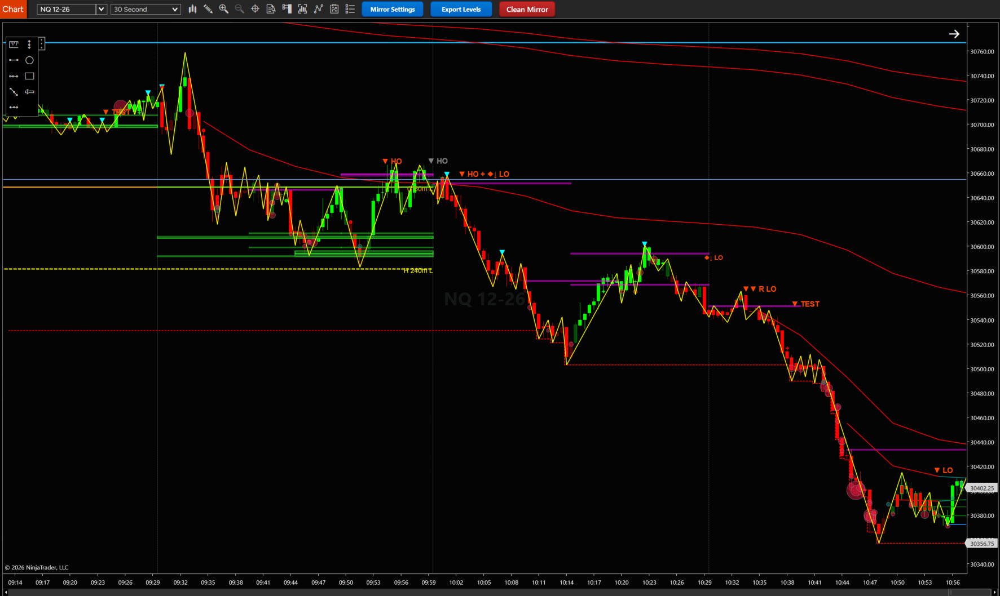

# Alighten NinjaTrader 8 Indicator Suite

A proprietary suite of custom NinjaTrader 8 indicators for order flow analysis, multi-timeframe
pattern recognition, and chart visualization — centered on the **Alighten Mirror Dashboard**
ecosystem.

This README is organized around the **reference chart**: the saved chart template in
`NinjaTrader/Templates/Chart/`, which is the intended way to load the suite. Everything the chart
needs is listed under [The reference chart](#the-reference-chart); everything else in the repo is
catalogued under [Other indicators](#other-indicators-not-on-the-reference-chart).

---

## The reference chart

**Template:** [`NinjaTrader/Templates/Chart/AlightenMirror_20261006.xml`](NinjaTrader/Templates/Chart/AlightenMirror_20261006.xml)
**Built on:** NQ 12-26, 30 Second, 3 days back (the template stores the period and days-back; the
instrument comes from whatever chart you apply it to).



The chart is a single price panel carrying eleven indicators. Reading it:

* **Auto AVWAPs** calculated on 5-minute bars — HOD/LOD, the previous session's HOPD/LOPD and
  Kris's TEST AVWAPs — with wick ▼▲, retest ▼▼ R / ▲▲ R and break ◆ markers on the 30-second bars.
  See [Auto AVWAP](#auto-avwap).
* The **BnB session VWAP is loaded but hidden**, and the chart no longer carries a volume profile.
* **Mirror levels and zones** as horizontal bands. Only the *inside* zone set is drawing on this
  chart — long zones green (`#25D725`), short zones magenta (`#FF00FF`), filled at 5% opacity with a
  50%-opacity outline, which is why they read as dark tints against the black background. Narrow
  bright bands are individual pattern levels. A yellow zigzag traces the structure the pattern
  engines are keyed to.
* Small arrows, dots and check marks on the bars are **confirmed pattern signals**; triangles are the
  Mirror's **zone-break retest** entries, which also play a sound.
* Three toolbar buttons — **Mirror Settings**, **Export Levels**, **Clean Mirror** — drive the
  Mirror's live settings modal, its CSV export, and its zone teardown/redraw.

### How this chart is configured

Two of these will surprise anyone reading the screenshot and assuming the Mirror is running wide
open. Values below are read directly out of the template.

| Setting | Value |
|---|---|
| Signal Groups (primary zones) | **disabled** — `EnableSignalGroups = false` |
| Inside Zones | **enabled** — [`MirrorInsideZonesV0040.txt`](NinjaTrader/ZoneFiles/MirrorInsideZonesV0040.txt) |
| Pattern engines computing | all six — A, B, G, H, F, J |
| Levels actually drawn | **Daily, 240m and 60m**, and only for A, G, H and F |
| Pattern B and Pattern J levels | computed, not drawn |
| Daily Bias Levels | enabled — goldenrod above, deep sky blue below |
| Zone breaks / retest signal | **14.1 Enable Zone Breaks** on; retest signal on with sound alerts; get-ready ★ hidden |
| Logs | zone log on, written to `Documents\NinjaTrader 8\Mirror Logs\` |
| Research log | **disabled** — `EnableResearchLog = false` |
| Drawing caps | 500 per zone set |
| Zone merging | off for both sets |
| Mirror source bars to process | 500 (`SrcBarsToProcess`) |
| Volume profile | none — RedTail was removed from the chart on 2026-10-04 |
| BnB VWAP | **loaded but hidden** (`IsVisible = false`); VWAP on, its own volume profile off (`ShowVP = false`) |
| Auto AVWAP | 5-min data series, stock session, signals on *session high/low + TEST* AVWAPs, sound alerts on |
| Bias | V0004 with the 6 most recent levels (scored levels off), no containment box |

So **every zone band on the chart is an inside zone** — the primary confluence set is switched off
entirely. And although all six engines run and keep feeding the zone search, level *drawing* is
restricted to the Daily, 240m and 60m timeframes for four of the six patterns; Pattern J, the densest
source, is computing invisibly.

This is worth knowing before you change anything: enabling Signal Groups or turning on more
timeframes will not "fix" a sparse chart, it will bury it.

### Files required to reproduce it

Load the template and NinjaTrader will look for all of the following. Every one is in this repo.

#### Indicators placed on the chart

| Indicator | Role on the chart |
|---|---|
| [`AlightenMirrorV0047Signal.cs`](NinjaTrader/Indicators/AlightenMirrorV0047Signal.cs) | The Mirror dashboard — levels, zones, zone-break retest signals with sound alerts, the three toolbar buttons |
| [`BnBTraderVPVWAPV0002.cs`](NinjaTrader/Indicators/BnBTraderVPVWAPV0002.cs) | Session VWAP + SD bands and prior-day H/L — its own volume profile is off on this chart |
| [`AlightenBiasV0004.cs`](NinjaTrader/Indicators/AlightenBiasV0004.cs) | FTG/FTL structural bias, with recent and/or scored levels |
| [`AutoAVWAPMTFV0006.cs`](NinjaTrader/Indicators/AutoAVWAPMTFV0006.cs) | Auto anchored VWAPs calculated on 5-min bars, with wick / retest / break signals — see [Auto AVWAP](#auto-avwap) |
| [`AlightenOrderFlowToolsV0006.cs`](NinjaTrader/Indicators/AlightenOrderFlowToolsV0006.cs) | Speed of tape, net speed of tape, trapped traders, stacked imbalance traps |
| [`AlightenButtonPanelV0005.cs`](NinjaTrader/Indicators/AlightenButtonPanelV0005.cs) | On-chart order flow / execution controls |
| [`AlightenVerticalLineAtIntervalV0001.cs`](NinjaTrader/Indicators/AlightenVerticalLineAtIntervalV0001.cs) | Vertical session/interval dividers |
| [`NebulaNT8NoCloud.cs`](NinjaTrader/Indicators/NebulaNT8NoCloud.cs) | Trend/reversal overlay; the Mirror also hosts it for an optional retest filter (third party — see [Attribution](#attribution)) |
| [`LabelRemover.cs`](NinjaTrader/Indicators/LabelRemover.cs) | Strips the text labels the other indicators write onto the chart |

Plus two NinjaTrader built-ins that ship with the platform and need no installation:
`CurrentDayOHL` and `DrawingToolTile`.

#### Hosted pattern engines (not placed on the chart)

The Mirror instantiates six pattern engines as calc-only children, once per timeframe — Daily,
240m, 60m, 30m, 15m, 10m, 5m — so one chart drives **42 detector instances**. These must be present
and compiled even though you never add them to a chart:

| Engine | Pattern |
|---|---|
| [`AlightenMirrorPtAV0011.cs`](NinjaTrader/Indicators/AlightenMirrorPtAV0011.cs) | A — ZigZag/level tracking, sequential wick-touch signals |
| [`AlightenMirrorPtBV0005.cs`](NinjaTrader/Indicators/AlightenMirrorPtBV0005.cs) | B |
| [`AlightenMirrorPtFV0004.cs`](NinjaTrader/Indicators/AlightenMirrorPtFV0004.cs) | F — precise breakouts and immediate retests |
| [`AlightenMirrorPtGV0003.cs`](NinjaTrader/Indicators/AlightenMirrorPtGV0003.cs) | G — level gained/lost arming with wick-retest |
| [`AlightenMirrorPtHV0003.cs`](NinjaTrader/Indicators/AlightenMirrorPtHV0003.cs) | H — "flipped G": a completed G whose level is then lost or gained |
| [`AlightenMirrorPtJV0008.cs`](NinjaTrader/Indicators/AlightenMirrorPtJV0008.cs) | J — paired pivots; the densest source by a wide margin |

#### Zone rule files

Read at runtime, **not** compiled — so they are plain text files you copy into place, not something
you compile in the NinjaScript Editor.

**Where to get them:** both live in this repo at
**[`NinjaTrader/ZoneFiles/`](NinjaTrader/ZoneFiles/)**. Download them from there and copy them into
`Documents\NinjaTrader 8\` — the user data folder itself, ***not*** `bin\Custom\`. The indicator
resolves a bare filename against that folder.

| File | Indicator setting |
|---|---|
| [`MirrorGroupsV0040.txt`](NinjaTrader/ZoneFiles/MirrorGroupsV0040.txt) | `12. Signal Groups` → Groups File |
| [`MirrorInsideZonesV0040.txt`](NinjaTrader/ZoneFiles/MirrorInsideZonesV0040.txt) | `13. Inside Zones` → Inside Zones File |

For the rule-file syntax and the silent-stub gotcha, see
[`NinjaTrader/ZoneFiles/README.md`](NinjaTrader/ZoneFiles/README.md).

### Installation order

1. Copy all 15 `.cs` files above into `Documents\NinjaTrader 8\bin\Custom\Indicators\`.
2. Copy both zone rule files from [`NinjaTrader/ZoneFiles/`](NinjaTrader/ZoneFiles/) into
   `Documents\NinjaTrader 8\` — **not** into `bin\Custom\`.
3. Compile in the NinjaScript Editor (**F5**). Compile *before* applying the template — a template
   referencing an uncompiled indicator drops it silently.
4. Apply [`AlightenMirror_20261006.xml`](NinjaTrader/Templates/Chart/AlightenMirror_20261006.xml) via
   Chart → Templates → Load.

---

## What a chart template does and does not carry

Worth knowing, because it determines what still has to be version-controlled alongside it.

**It does carry** the complete settings for every indicator instance. Each indicator is serialized
with its full public property set — custom parameters, every plot's brush, dash style and width,
plus panel assignment, Z-order, `Calculate` mode and `MaximumBarsLookBack`. The [`BnBTraderVPVWAPV0002`](NinjaTrader/Indicators/BnBTraderVPVWAPV0002.cs)
node, for example, stores 45 properties including `VPWidth = 160`, `VPOpacity = 40`,
`VAPercentage = 70`, `SD1/2/3_Mult = 1/2/3`, `ShowNakedPOCs`, `ShowPriorDay`, and the full plot
palette (VWAP Curve goldenrod, POC yellow, VAH red, VAL green, PDH/PDL deep pink, SD bands in three
grays). It also stores the data series settings — bars period and days-back.

**It does not carry:**

* **The indicator code.** A template is a settings document; the `.cs` files must already be
  compiled or the indicator is dropped on load.
* **The zone rule files.** The template stores the *filenames* ([`MirrorGroupsV0040.txt`](NinjaTrader/ZoneFiles/MirrorGroupsV0040.txt),
  [`MirrorInsideZonesV0040.txt`](NinjaTrader/ZoneFiles/MirrorInsideZonesV0040.txt)) as indicator settings, but not their contents. A missing rule file
  does not error — the loader silently writes a two-rule stub. See the operational notes below.
* **The instrument.** No instrument name is serialized; the template supplies the period and
  days-back, and the chart supplies the symbol.

---

## Production versions

The highest version number is **not** always the production version — abandoned experiments
sometimes carry higher numbers. This table is the source of truth; update it whenever a version is
promoted or retired.

| Indicator family | Production version | On the reference chart |
|---|---|---|
| Mirror Dashboard | [`AlightenMirrorV0047Signal`](NinjaTrader/Indicators/AlightenMirrorV0047Signal.cs) | same |
| Pattern A source | [`AlightenMirrorPtAV0011`](NinjaTrader/Indicators/AlightenMirrorPtAV0011.cs) | same |
| Pattern B source | [`AlightenMirrorPtBV0005`](NinjaTrader/Indicators/AlightenMirrorPtBV0005.cs) | same |
| Pattern F source | [`AlightenMirrorPtFV0004`](NinjaTrader/Indicators/AlightenMirrorPtFV0004.cs) | same |
| Pattern G source | [`AlightenMirrorPtGV0003`](NinjaTrader/Indicators/AlightenMirrorPtGV0003.cs) | same |
| Pattern H source | [`AlightenMirrorPtHV0003`](NinjaTrader/Indicators/AlightenMirrorPtHV0003.cs) | same |
| Pattern J source | [`AlightenMirrorPtJV0008`](NinjaTrader/Indicators/AlightenMirrorPtJV0008.cs) | same |
| VWAP | [`BnBTraderVPVWAPV0002`](NinjaTrader/Indicators/BnBTraderVPVWAPV0002.cs) | same — hidden, volume profile switched off |
| Volume Profile | [`RedTailVolumeProfile`](NinjaTrader/Indicators/RedTailVolumeProfile.cs) | not on chart |
| Order Flow Tools | [`AlightenOrderFlowToolsV0006`](NinjaTrader/Indicators/AlightenOrderFlowToolsV0006.cs) | same |
| Bias | [`AlightenBiasV0004`](NinjaTrader/Indicators/AlightenBiasV0004.cs) | same |
| Auto AVWAP | [`AutoAVWAPMTFV0006`](NinjaTrader/Indicators/AutoAVWAPMTFV0006.cs) | same |
| Button Panel | [`AlightenButtonPanelV0005`](NinjaTrader/Indicators/AlightenButtonPanelV0005.cs) | same |
| Bar Timer | [`AlightenBarTimerV0004`](NinjaTrader/Indicators/AlightenBarTimerV0004.cs) (V3 also in repo) | not on chart |
| Vertical Line at Interval | [`AlightenVerticalLineAtIntervalV0001`](NinjaTrader/Indicators/AlightenVerticalLineAtIntervalV0001.cs) | same |
| Footprint OrderFlow | [`AlightenFootprintOrderFlowV00021`](NinjaTrader/Indicators/AlightenFootprintOrderFlowV00021.cs) | not on chart |
| HTF Volume Profile | [`AlightenHTFVPV0004`](NinjaTrader/Indicators/AlightenHTFVPV0004.cs) | not on chart |
| Relative Delta | [`AlightenRelativeDeltaV0001`](NinjaTrader/Indicators/AlightenRelativeDeltaV0001.cs) | not on chart |
| Relative Delta MultiTF | [`AlightenRelativeDeltaMultiTFV0002`](NinjaTrader/Indicators/AlightenRelativeDeltaMultiTFV0002.cs) (V0003 = abandoned experiment) | not on chart |

**The chart and the table agree.** The Bar Timer and RedTail volume profile are no longer on the
reference chart (2026-10-04); both stay in the repo.

**Retired 2026-10-04.** `AlightenMirrorV0045Signal` was removed from this repo, superseded by
[`AlightenMirrorV0047Signal`](NinjaTrader/Indicators/AlightenMirrorV0047Signal.cs). It adds the
**zone-break retest entry signal**: a bar closes through a zone (a "get ready" ★ and a watch), a later
bar's wick reaches that zone's projected level, and the signal is confirmed when that bar becomes a
chart-series pivot. Every broken zone keeps its own watch, so stacked zones each arm. Also new:
optional retest **sound alerts** (realtime only, posted to the Alerts window with instrument and
period); every zone / level / retest **log line stamped** with a load id and the replay bar time, a
`REALTIME` marker separating history rebuilt at load from what was seen live, and all logs written to
`Documents\NinjaTrader 8\Mirror Logs` (append-only); and the **settings regrouped** into 17 numbered
groups (1.1 ... 17.8). Note the rename: *Show Zone-Cross Arrows* is now **14.1 Enable Zone Breaks
(required for Retest)** — it was always the master switch for break detection, and with it off the
retest signal never arms. Hosts the same pattern sources as V0045, plus
[`NebulaNT8NoCloud`](NinjaTrader/Indicators/NebulaNT8NoCloud.cs), which gained a `BrightState` plot
(appended last) for the optional *Require Nebula Bright* filter.

**Retired 2026-10-04.** `AlightenBiasV0003` was removed from this repo, superseded by
[`AlightenBiasV0004`](NinjaTrader/Indicators/AlightenBiasV0004.cs), which keeps V0003's pivot and
FTG/FTL engine and adds a second way to choose the levels it evaluates: **scored levels**, using the
priority score from Kris's MidPoint Mania — `w · log(1 + swing / ATR) + (1 − w) · (1 − distance / window)`,
with a stability bonus for levels already selected and a cluster distance between picks. **Recent**
(V0003's newest-N) and **scored** selection can run alone or together. Scored levels get their own
dashed style and long/short colours. The Mirror's Daily Bias Levels remain an inline port of the
V0003 pivot rules.

**Retired 2026-09-18.** `BnBTraderVPVWAPV0001` was removed from this repo, superseded by
[`BnBTraderVPVWAPV0002`](NinjaTrader/Indicators/BnBTraderVPVWAPV0002.cs). Its two feature switches only hid
the drawing: the 1-tick secondary series, the volume-at-price accumulation, the value-area
calculation and the whole VWAP accumulation ran regardless. In V0002 they disable the work.
**Show Volume Profile** off means the 1-tick series is never added and no profile is built -
so a different volume profile can run alongside this VWAP without paying for two - and naked
POCs go with it. **Show VWAP** off stops all VWAP accumulation and resets the seven VWAP
plots. Prior-day H/L is independent of both. The VWAP never read the tick series (it uses
the chart bars: typical price x bar volume historically, per-tick volume deltas live), so it
is identical with the profile off.

**Retired 2026-09-18.** `AlightenMirrorV0044Signal` and `AlightenMirrorPtJV0007` were removed from
this repo, superseded by `AlightenMirrorV0045Signal` (itself retired 2026-10-04)
and [`AlightenMirrorPtJV0008`](NinjaTrader/Indicators/AlightenMirrorPtJV0008.cs). The Mirror is a
rename-only copy; the real change is in Pattern J. V0007's realtime path published ONE node per side
into slot 0 and chose it by `Dictionary` enumeration order, while the closed-bar path fills all four
slots - so on a forming HTF bar a hosting Mirror saw one arbitrary J level, and an inside zone whose
partner sat within its tick cap of a different node could not form until the bar closed. Measured on
2026-09-17 02:50 (10m): the live level was J@29457.00, 19 ticks from A@29461.75, so rule
`A10L, J10L; 10T` refused a zone; at the close 29459.25/29459.50/29460.00 arrived 7-10 ticks from A
and it appeared at 03:01 - all four nodes had existed while the bar was forming. V0008 collects every
qualifying node (deduped), applies the same `CapSlotsByDistance` filter as the closed path, and writes
all four slots. Tradeoff: provisional values repaint by design, so more zones flicker intrabar.
Verified against 2026-09-17 02:50 and 2026-09-15 14:50.

**Retired 2026-09-16.** `AlightenMirrorV0043Signal` was removed from this repo, superseded by
`AlightenMirrorV0045Signal` (itself retired 2026-10-04), which fixed the
daily-bias pivot port. `ProcessDailyBiasBar` fired only four of `AlightenBiasV0003`'s six two-bar
pivot conditions, so an outside day (higher high **and** lower low) recorded one pivot where the Bias
records two. Pivots alternate high/low, so a dropped pivot also shifted every later same-side
replacement: 284 vs 220 pivots over 775 ETH daily bars, with the visible N-level set differing on
73.5% of days. The symptom was a *newer* daily level missing while an older one still drew. The two
added conditions are `prevRed && currGreen && isHigh` and `prevGreen && currRed && isLow`. Verified
2026-09-16 against the Bias on a daily chart. The daily-bias `Number Of Levels (N)` default is now 7.

**Retired 2026-09-15.** `AlightenMirrorV0041`, `AlightenMirrorV0041Signal`, `AlightenMirrorPtAV0010`,
`AlightenMirrorPtFV0003`, `AlightenMirrorPtGV0002` and `AlightenMirrorPtHV0002` were removed from
this repo and from `bin\Custom`. The four pattern engines were superseded by versions that fix a
closed-bar level-publishing defect: a bar signalling **both** long and short published *neither*
level, so the Mirror never ingested it — no CREATE and no REMOVE in the level log — and the level
could not rebuild after a reload even though the chart still drew it. See the header comment in each
new engine for the full diagnosis. Pattern B was unaffected (it never writes its level plots at `[1]`)
and Pattern J uses a different multi-slot publish path.

---

## The Mirror Dashboard

The Mirror separates **pattern detection** from **presentation**. Six pattern engines each run as a
calc-only child indicator hosted once per timeframe; the Mirror consolidates what they report into
levels, groups those levels into zones, draws everything, and logs it.

### Levels

A **level** is one pattern engine's output on one timeframe: a price, a direction (long or short),
and a window running from the higher-timeframe bar that produced it to that bar's close. Levels are
keyed `MR_<pattern>_TF<n>_<L|S>_<startTicks>` and held in `tracked[pattern][timeframe]`.

Two behaviours surprise people:

* **Levels sync at their window CLOSE during historical processing**, not while the bar forms. Logic
  that asks "is this level's window open right now" therefore never matches on a reload — which is
  why zones are built from window *overlap* instead.
* **Stale levels are archived, not deleted.** Past the retention floor they move out of `tracked`
  into `_archivedLevels`, keeping their chart drawings and still appearing in exports, but no longer
  costing per-tick scans. Zone rebuilding reads only `tracked`.

### Zones

A **zone** is a confluence of levels that a rule file asked for. A rule names two or more signals
and a maximum price spread; a zone exists wherever one live level per named signal sits inside that
spread, with all member windows **coexisting in time**.

```
J240L, J60L, J15L; 40T          three long levels — 4H, 1H, 15m — within 40 ticks
A15S, J15S; 20T; ANCHORED       two shorts within 20 ticks, others on the anchor's protected side
```

* **Signal** — pattern letter (A B G H F J) + timeframe (D 240 60 30 15 10 5) + direction (L or S)
* **Spread** — `<n>T`, the maximum distance from the lowest member to the highest
* **ANCHORED** — the highest-timeframe member is the anchor; every other member must sit on its
  protected side (at or below a long anchor, at or above a short)
* **ORDERED** — the listed order is the required price order, lowest first

A zone is identified at the **latest** member window start and ends at the **latest** member end,
computed purely from level records so historical and realtime produce identical zones. Its key is
the rule's index plus that start time, so several member combinations collapse into one zone. When
they disagree the **tightest** combination wins — which means a drawn band is often narrower than
the levels that formed it.

### Two independent zone sets

Both sets run the same machinery over separate rule files, with their own colours, opacity, merge
behaviour and drawing caps:

| Set | Property group | Rule file | Intent |
|---|---|---|---|
| **Primary** | `12. Signal Groups` | [`MirrorGroupsV0040.txt`](NinjaTrader/ZoneFiles/MirrorGroupsV0040.txt) | confluence stacks spanning 3+ timeframes |
| **Inside** | `13. Inside Zones` | [`MirrorInsideZonesV0040.txt`](NinjaTrader/ZoneFiles/MirrorInsideZonesV0040.txt) | narrower pairs sitting between a primary zone and price |

On the reference chart only the **Inside** set is enabled, so its zones are not in fact sitting
between a primary zone and price — there are no primary zones drawn. That is legal, because the
engine does not enforce the geometry (see below); it just means the set is being used on its own
terms rather than as the inner half of a pair.

Draw tags are prefixed per set (`PRI_` / `INS_`) so the two can never fight over one chart object,
merging never crosses sets, and each writes its own forensics trail — `MirrorZonesV0041_PRI.log`
and `_INS.log` — recording every zone created, extended, erased and purged.

The engine does **not** enforce the inside/outside geometry. It draws two independent sets; whether
an inside zone actually sits between a primary zone and price is a property of how the rules are
written, not something the code checks.

### Operational notes

Four behaviours that look like bugs and are not:

* **`Max Zone Drawings` / `Max Inside Zone Drawings`** bound how many rectangles each set keeps on
  the chart. Past the cap the oldest drawing is deleted — while the zone stays live in memory. Old
  zones vanishing, most visibly after **Clean Mirror** (which tears everything down and redraws from
  memory), is this cap, not the zone engine. Raise it before suspecting anything else.
* **Clean Mirror does two separate things.** It erases still-live zones so they rebuild on the next
  bar, *and* it permanently dismisses zones sitting on the adverse side of price that never
  "worked" — price never traded through their favourable side. Long-lived 4H-anchored zones rarely
  get stamped as worked, so Clean deletes them; short-lived low-timeframe zones usually do, and
  survive.
* **A missing rule file is not an error.** The loader silently creates a stub containing two example
  rules. A `rules=2` load banner in the zone log means the filename in the settings did not resolve.
* **Rule order matters.** The zone key is built from the rule's *index*, so inserting a rule
  mid-file renumbers every rule after it. Append instead.

### Export

`Export Mode` suppresses every `Draw.*` call while keeping all level computation, which is what
makes a deep-history run survivable — chart objects are the cost, not the level math. **Export
Levels** then writes a matched set sharing one timestamp:

| File | Contents |
|---|---|
| `MirrorLevels_*.csv` | every level with price, window, tag and lifecycle flags |
| `MirrorBars_*.csv` | OHLCV for the primary series and all seven added series |
| `MirrorExport_*.meta.json` | per-series bar counts and first/last timestamps |
| `MirrorResearch_Events/Context_*.csv` | confirmed signals with forward MFE/MAE and confluence context |

`MirrorBars` exists so offline analysis never has to reconstruct NinjaTrader's session boundaries by
resampling — a reconstruction that quietly disagrees with the indicator's own view.

Export depth is governed by the **chart's Days-to-Load**, not by `SrcBarsToProcess`. Note also that
only the Daily/240m/60m/30m/15m series honour `SrcBarsToProcess`; 10m and 5m follow the chart. The
`series` block in the meta sidecar records what each series actually covered.

### Zone search performance

Candidate levels are price-sorted and cached once per bar per `(pattern, timeframe, direction)`,
shared across every rule and both sets — one scan where the naive version did one per rule
reference. The combination search then pins the scarcest member slot and binary-searches the others
for the `±MaxTicks` window around it. Because every valid combination has all its members within
`MaxTicks` of *any* one member, that window is an **exact** prefilter, verified equivalent to the
full cartesian product on real level data. It is what makes a 100-rule file affordable; the naive
version evaluated over nine million combinations per bar on the same file.

### Pattern engine notes

* **[`AlightenMirrorPtAV0011`](NinjaTrader/Indicators/AlightenMirrorPtAV0011.cs)** — Pattern A: ZigZag/level tracking with sequential wick-touch signals
  (consecutive touch bars all signal until the sequence breaks).
* **[`AlightenMirrorPtGV0003`](NinjaTrader/Indicators/AlightenMirrorPtGV0003.cs)** — Pattern G: level gained/lost arming with wick-retest signals.
* **[`AlightenMirrorPtHV0003`](NinjaTrader/Indicators/AlightenMirrorPtHV0003.cs)** — Pattern H, the "flipped Pattern G": a completed G pattern whose
  level is then lost or gained arms the opposite-direction retest.
* **[`AlightenMirrorPtFV0004`](NinjaTrader/Indicators/AlightenMirrorPtFV0004.cs)** — Pattern F: precise breakouts and immediate retests of structure.
* **[`AlightenMirrorPtJV0008`](NinjaTrader/Indicators/AlightenMirrorPtJV0008.cs)** — Pattern J (paired pivots), the densest source by a wide margin.
  Qualified zigzag pairs with minimum trend bars/ticks, levels at the pivot candle's body, endpoint
  gain/loss state machines with first-touch tests, triangle test markers, and optional
  flip-invalidation of past signals. Serves both standalone chart use and Mirror hosting via
  `PatternJLongLevel` / `PatternJShortLevel` / `PatternJSignal`, including provisional evaluation of
  the forming bar and a Calc-Only mode.

---

## Volume profile and VWAP

**[`BnBTraderVPVWAPV0002.cs`](NinjaTrader/Indicators/BnBTraderVPVWAPV0002.cs)** — session volume profile (POC / VAH / VAL), naked POCs, prior-day
high/low, and session VWAP with three standard-deviation band pairs.

Originally the work of **BnBTrader**, derived from `BnBTraderRbsScalperV9` — the VWAP engine
(session anchoring, the cumulative `price·volume` and `price²·volume` accumulators, and the SD
bands) is carried over verbatim.

The **volume profile was rebuilt by Alighten** on a 1-tick secondary series, so POC/VAH/VAL match
NinjaTrader OrderFlow+ Volume Profile **without requiring Tick Replay**. Tick Replay exists to
rebuild historical bid/ask and depth context, which this profile never uses, so a plain tick series
is both sufficient and far cheaper. Value Area defaults to **70%** (the Market Profile convention
OrderFlow+ uses) rather than the true 1σ figure of 68%, so VAH/VAL line up with OF+.

Exposes `VWAP_Curve`, `POC_Data`, `VAH_Data`, `VAL_Data`, `PDH_Data`, `PDL_Data` as series for
strategies and Bloodhound.

**On the reference chart BnB is loaded but hidden**, with its own profile switched off (`Show Volume
Profile = false`); in V0002 that also skips the 1-tick series entirely, so it costs nothing. Since
2026-10-04 the chart carries no volume profile — RedTail below is documented but not loaded.

### RedTail volume profile

**[`RedTailVolumeProfile.cs`](NinjaTrader/Indicators/RedTailVolumeProfile.cs)** — by **RedTail
Indicators**. Session, weekly, composite and move profiles, naked levels, value-area lines and alerts.

Its VAH/VAL will not match BnB's exactly, and that is expected rather than a bug. The session
profile differs in four ways:

1. **Volume source.** It is built from the chart bars, spreading each bar's whole volume evenly
   across every row the bar's high-low touches. BnB puts each trade at the exact price it traded.
   RedTail's own 1-tick series feeds only its per-bar candle profiles, never the session profile.
2. **Row size.** A fixed 250 rows span the session high to low, so the row height depends on the
   day's range - about 1.2 points on a 300-point NQ day - and VAH/VAL snap to that grid. BnB uses
   one row per tick.
3. **Value-area percentage.** 68% by default, against BnB's 70%.
4. **Expansion.** It grows the value area one row at a time; BnB uses the standard Market Profile
   paired-row walk (two rows above against two below).

Setting RedTail to 70% and raising **Number of Volume Bars** toward one row per tick removes the
second and third differences. The first cannot be removed: the session profile has no
information about where volume traded inside each bar, so on larger bars the gap grows.

---

## Auto AVWAP

**[`AutoAVWAPMTFV0006.cs`](NinjaTrader/Indicators/AutoAVWAPMTFV0006.cs)** — automatic anchored VWAPs
(AVWAPs), built on Kris's AutoAVWAP (see [Attribution](#attribution)). It anchors VWAPs at the places
the market makes decisions and turns price's interaction with them into signals.

### The AVWAPs

| Label | Anchored at |
|---|---|
| **HOD / LOD** | the current session's high / low (the anchor moves when a new extreme prints) |
| **HOPD / LOPD** | the previous session's high / low |
| **TEST** | a bar that tested an AVWAP and held — Kris's "progression" AVWAPs, which trail price in a trend |
| **OPEN / GAP** | the open-anchor time / a gap between bars larger than the minimum gap size |

AVWAPs that price closes through are deleted (HOD/LOD/HOPD/LOPD flip side instead). Anchored VWAPs
can **cross**: each new bar pulls a line toward its price in proportion to the bar's volume over the
volume already in the line, so a later-anchored, lighter line moves faster and can overtake an older
one (on 2026-09-28 the HOPD and LOPD AVWAPs crossed at 08:20).

### Calculated on one timeframe, drawn on another

**Data series minutes** (default 5) adds a minute series and runs every anchor, test and session rule
on it, exactly as the original would on a chart of that period; the chart only displays the result.
A 30-second chart therefore shows the 5-minute AVWAPs, with each line drawn between 5-minute closes.
Bar-count settings count bars of that series. **Data series bars to load** loads that series
independently of the chart — when the series and the chart share a period (5-min on a 5-min chart)
NinjaTrader reuses the chart's bars and ignores it, so load enough history on the chart itself.

**Developing AVWAP (V0006).** Between 5-minute closes, each AVWAP also draws a **dashed segment** from
its last 5-minute close to the current chart bar, at the level that includes the 5-minute bar still
forming, so on the 30-second chart you can see where every AVWAP will print before the bar closes.
When the 5-minute bar closes, the solid segment replaces it and a new dashed one starts. The HOD/LOD
labels follow the developing level. It runs only in realtime and Playback (never on historical bars)
and redraws in place at most every 250 ms. Settings: **Developing** group (D.1 – D.3).

Sessions: **Day** resets at the start of the active session — **Use stock session** (default on,
`0930-1600` New York) or the futures session (`1800-1700`) — and session high/low AVWAPs only form
inside it, so HOD/LOD and HOPD/LOPD are cash-session levels. **4 Hours** (Kris's TradingView option)
also resets every 4-hour block of the trading session. No AVWAPs are drawn until the first real
session start, so a short load shows nothing instead of a partial session's high/low.

### Signals

Each signal is judged on a completed 5-minute bar and drawn on the **first chart bar after it
closes** — the bar you can act on — with a sound alert. A marker reads left to right:
`[✕ or ⇅] arrow [R] AVWAP [+ ◆ break]`.

* **▼ / ▲ Wick — a level that held.** A bar comes from one side, reaches the AVWAP (within the wick
  tolerance, 12 ticks) and does not close clearly through it. *2026-09-28 10:00 `▼ HO`: below the HOD
  AVWAP all morning, rose into it, closed back below.*
* **▼▼ R / ▲▲ R Retest — a level that broke, then flipped.** First a bar closes **through** the AVWAP;
  later a bar comes back from the new side, wicks into it and is rejected. Old support becomes
  resistance (or the reverse). **R always means retest.** *09-28 10:30 closed below the LOD AVWAP;
  10:35 came back up into it and closed below: `▼▼ R LO`.*
* **On the line.** A close within the **close margin** (4 ticks) counts as *on* the AVWAP — not a
  break — so bodies parked on a level read as tests that held. *09-29 09:45 and 09:50 both sat on the
  LOPD AVWAP: two holds, `▲▲ R LOP`.*
* **◆↓ / ◆↑ Break — direction.** A bar closing clearly through a HOD/LOD/HOPD/LOPD AVWAP at least 2
  bars old sets the direction (◆↓ short, ◆↑ long). TEST, OPEN and GAP AVWAPs give signals but never
  change direction. *09-28 11:00 `◆↑ LO`: closed back above the new LOD AVWAP — the bottom.*
* **✕ Against the direction.** The signal points against the last break, or a break the other way
  cancelled it within 3 bars. It stays on the chart, greyed, with no sound.
* **⇅ Mixed bar.** One bar broke one way **and** signalled the other. Neither side wins: the direction
  resets to neutral and the signal draws with ⇅. *09-28 12:30 closed above HOPD while rejecting LOPD:
  `⇅ ▼▼ R LOP`.*
* **+** — a signal and a break on the same bar and side share one label: `▼ HO + ◆↓ LO`.
* **Grey = weak.** Reward:risk below 1:1, where the stop is just beyond the signal bar's wick (+4
  ticks) and the target is the nearest HOD/LOD/HOPD/LOPD AVWAP beyond the entry. Grey means "a major
  AVWAP is close in front of you", not "this will fail".

A signal on an AVWAP born one bar earlier can be a 5-minute wick that was really a cross on the
30-second chart — check the 30-second bars.

### Outputs

* **Signal log** — every signal, break, cancel and its forward outcome (target or stop first, MFE,
  MAE), appended to `Documents\NinjaTrader 8\Mirror Logs\AutoAVWAPSignalsV0006_<instrument>.log`.
* **Market Analyzer plots** — `AVWAPSignal` (±1 wick, ±2 retest), `CrossSignal`, `TestSignal`,
  `BarsSince…`, `LiveTest`, `DistanceTicks` and `Bias`, listed in the Data Box.
* The original test-bar colouring is still available, colouring every chart bar inside a test bar.

All signal settings are in the **Signals** group (S.1 – S.29) and are display-only, so they do not
change the indicator's generated factory signature.

---

## Other indicators on the chart

* **[`AlightenBiasV0004.cs`](NinjaTrader/Indicators/AlightenBiasV0004.cs)** — evaluates multi-level FTG (Failed To Go) and FTL (Failed To Lower)
  structures to determine current market bias. Levels come from the newest pivots, from Kris's
  MidPoint Mania priority score (swing size against proximity), or both. The V0003 pivot rules also
  power the Mirror's Daily Bias Levels, ported inline.
* **[`AutoAVWAPMTFV0006.cs`](NinjaTrader/Indicators/AutoAVWAPMTFV0006.cs)** — automatic anchored VWAPs and their signals. See
  [Auto AVWAP](#auto-avwap).
* **[`AlightenOrderFlowToolsV0006.cs`](NinjaTrader/Indicators/AlightenOrderFlowToolsV0006.cs)** — tape and imbalance analytics: speed of tape, net speed of
  tape and their running maxima, trapped traders, and stacked imbalance traps.
* **[`AlightenButtonPanelV0005.cs`](NinjaTrader/Indicators/AlightenButtonPanelV0005.cs)** — interactive on-chart button panel for order flow parameters
  and execution logic (e.g. "Breakeven + X Ticks").
* **[`AlightenVerticalLineAtIntervalV0001.cs`](NinjaTrader/Indicators/AlightenVerticalLineAtIntervalV0001.cs)** — vertical dividers at a configurable interval.
* **[`NebulaNT8NoCloud.cs`](NinjaTrader/Indicators/NebulaNT8NoCloud.cs)** — trend and reversal overlay. **Third party**, see below.

---

## Other indicators (not on the reference chart)

* **[`AlightenBarTimerV3.cs`](NinjaTrader/Indicators/AlightenBarTimerV3.cs)** — bar countdown rendered through the Direct2D `OnRender` pipeline,
  eliminating the flicker common to UI-based bar timers. ([`AlightenBarTimerV0004.cs`](NinjaTrader/Indicators/AlightenBarTimerV0004.cs) is the newer
  line; neither is on the reference chart.)
* **[`AlightenFootprintOrderFlowV00021.cs`](NinjaTrader/Indicators/AlightenFootprintOrderFlowV00021.cs)** — footprint indicator aggregating bid, ask, delta,
  volume, POC and value area natively. Emits clean arrays for Bloodhound/strategies.
* **[`AlightenHTFVPV0004.cs`](NinjaTrader/Indicators/AlightenHTFVPV0004.cs)** — higher-timeframe volume profile, projecting an HTF bar's POC and
  value area onto lower-timeframe charts for the duration of the next HTF bar.
* **[`AlightenRelativeDeltaV0001.cs`](NinjaTrader/Indicators/AlightenRelativeDeltaV0001.cs)** — relative delta footprint visualization.
* **[`AlightenRelativeDeltaMultiTFV0002.cs`](NinjaTrader/Indicators/AlightenRelativeDeltaMultiTFV0002.cs)** — multi-timeframe relative delta wick heatmap with
  audio alerts on cross-timeframe alignment.
* **[`VolumeDelta.cs`](NinjaTrader/Indicators/VolumeDelta.cs)** — core volume delta calculation engine.
* **[`HigherTimeframeCandles.cs`](NinjaTrader/Indicators/HigherTimeframeCandles.cs)** — projects HTF candle OHLC onto lower-timeframe charts.
* **[`IndicatorVisualStyleHelper.cs`](NinjaTrader/Indicators/IndicatorVisualStyleHelper.cs)** — centralized brush/stroke/font styling shared across the suite.
* **[`OrderLineDecorator.cs`](NinjaTrader/Indicators/OrderLineDecorator.cs)** — enhances the presentation of active order lines.

---

## Repository structure

```
NinjaTrader/
  Indicators/        compiled NinjaScript indicators
  Strategies/        strategies
  AddOns/            add-ons
  BarsTypes/         custom bar types
  MarketAnalyzerColumns/
  ZoneFiles/         runtime zone rule files (NOT NinjaScript — see its README)
  Templates/Chart/   saved chart templates
```

Files in `Indicators/` generally carry NinjaTrader's `#region NinjaScript generated code` block,
which defines each indicator's factory method. **Do not strip that region** from a file that other
indicators construct — the callers stop compiling, and NinjaTrader only rewrites the region after a
*successful* build of the whole assembly, so it deadlocks.

*Legacy and WIP scripts prefixed with `@` are excluded from this index and from git.*

## Attribution

* **[`AutoAVWAPMTFV0006.cs`](NinjaTrader/Indicators/AutoAVWAPMTFV0006.cs)** — built on **Kris**'s AutoAVWAP (his TradingView
  "Auto AVWAP" and its NinjaTrader v4 port): the anchoring rules, the test / gap / open AVWAPs, the
  session and 4-hour behaviours and the test-bar colouring are his. The multi-timeframe calculation,
  session fixes, signals and logging are by Alighten. Included with permission.
* **[`AlightenBiasV0004.cs`](NinjaTrader/Indicators/AlightenBiasV0004.cs)** — the scored-level priority formula comes from
  **Kris**'s MidPoint Mania. Included with permission.
* **[`BnBTraderVPVWAPV0002.cs`](NinjaTrader/Indicators/BnBTraderVPVWAPV0002.cs)** — original VWAP work by **BnBTrader** (from
  `BnBTraderRbsScalperV9`); volume profile updated by Alighten. Included with permission.
* **[`NebulaNT8NoCloud.cs`](NinjaTrader/Indicators/NebulaNT8NoCloud.cs)** — converted from the TradingView Pine script "Nebula v2.2", which is
  **MPL-2.0** and credits **TraderOracle** plus the component authors named there. Included with
  permission; redistribution carries MPL-2.0 attribution obligations.
* **[`RedTailVolumeProfile.cs`](NinjaTrader/Indicators/RedTailVolumeProfile.cs)** — by **RedTail Indicators**
  (@_hawkeye_13), under the **Mozilla Public License 2.0**; the licence notice is kept in the file
  header. This is the current version, which adds `GetCurrentVALevels()` for RedTailMarketStructure.
